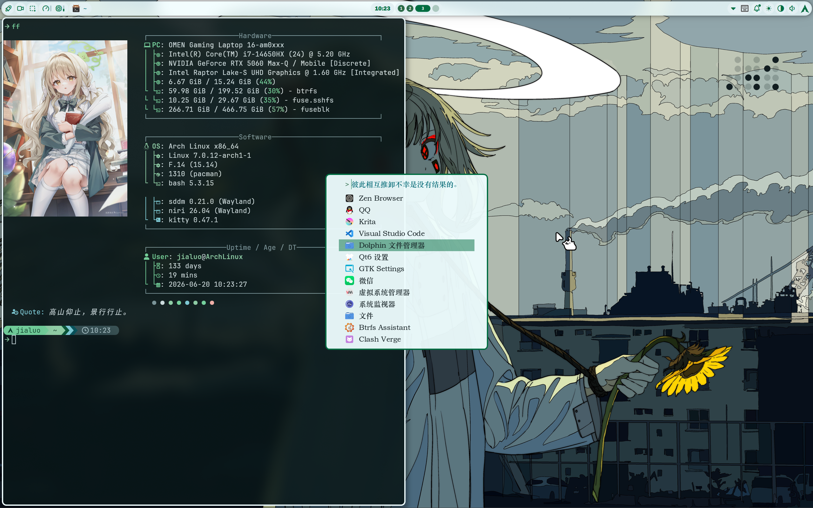

# dotfile-arch-linux

Arch Linux dotfiles backup. Last updated: 2026-06-20.

## Structure

```
home/           # Top-level dotfiles (~/.*)
  .zshrc
  .bashrc
  .gitconfig
  ...

bin/            # Personal scripts (~/bin/)
  fetch_anime.sh
  ff
  fuzzel-hitokoto.sh

config/         # Config directories (~/.config/<name>)
  niri/         # Wayland compositor (Niri)
  kitty/        # Terminal emulator
  nvim/         # Neovim (LazyVim based)
  starship/     # Shell prompt
  fastfetch/    # System info fetcher
  fuzzel/       # Launcher
  btop/         # Resource monitor
  yazi/         # Terminal file manager
  fcitx5/       # Input method (Rime)
  cava/         # Audio visualizer
  mpv/          # Media player
  noctalia/     # Niri bar (noctalia-shell) config & templates
  qt5ct/qt6ct/  # Qt theme config
  gtk-3.0/gtk-4.0/  # GTK theme config
  environment.d/    # Environment variables
  xsettingsd/   # Xsettings daemon
  pacseek/      # Pacman frontend
  yay/          # AUR helper
  ...
```

## Key Details

- **Compositor**: Niri
- **Shell**: Zsh with Oh-My-Zsh + Starship prompt
- **niri bar**: noctalia-shell
- **KDE Plasma Theme**:  ChromeOS-dark
- **Font**: ChillRoundM
- **Icons**: Tela
- **Cursor**: cat_cursors(on niri)/hei_cursors(on kde)
- **Terminal Font**: JetBrainsMonoNLNF-Regular

## Screenshots

### effect 1 (niri)



### effect 2 (kde)


