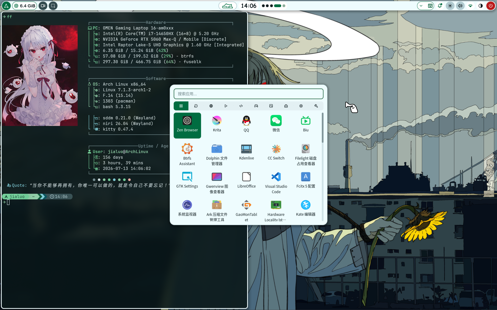
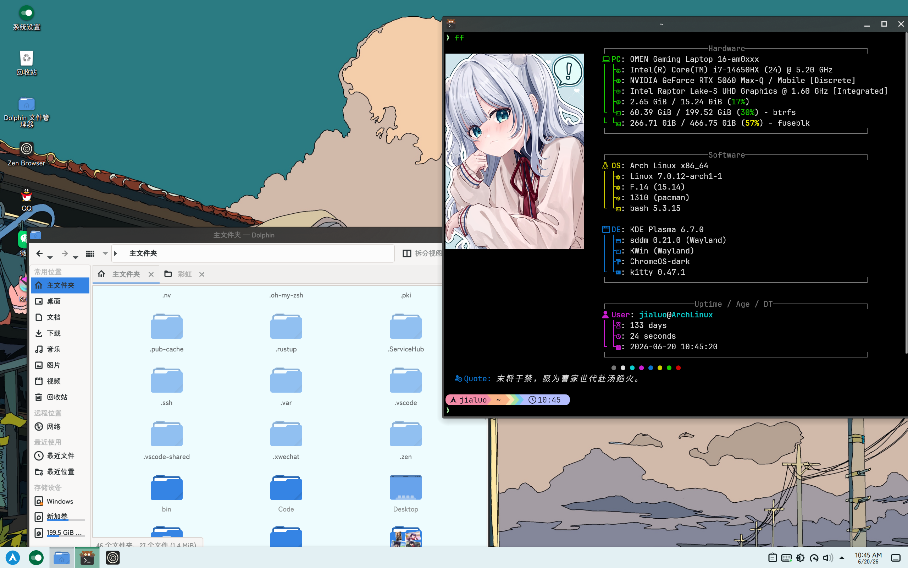

# dotfile-arch-linux

[English](README.md)

Arch Linux dotfiles 备份。最近更新：2026-07-24。

## 目录结构

```
home/           # 顶级 dotfiles (~/.*)
  .zshrc
  .bashrc
  .gitconfig
  ...

bin/            # 个人脚本 (~/bin/)
  fetch_anime.sh
  ff
  fuzzel-hitokoto.sh

config/         # 配置目录 (~/.config/<name>)
  niri/         # Wayland 合成器 (Niri)
  kitty/        # 终端模拟器
  nvim/         # Neovim (基于 LazyVim)
  starship/     # Shell 提示符
  fastfetch/    # 系统信息工具
  fuzzel/       # 启动器
  btop/         # 资源监控器
  yazi/         # 终端文件管理器
  fcitx5/       # 输入法 (Rime)
  cava/         # 音频可视化
  mpv/          # 媒体播放器
  noctalia/     # Niri 状态栏 (noctalia-shell) 配置与模板
  qt5ct/qt6ct/  # Qt 主题配置
  gtk-3.0/gtk-4.0/  # GTK 主题配置
  environment.d/    # 环境变量
  xsettingsd/   # Xsettings 守护进程
  pacseek/      # Pacman 前端
  yay/          # AUR 助手
  fontconfig/   # 字体配置 (CJK, 别名)
  dolphinrc     # Dolphin 文件管理器 (Niri 主力文件管理器)
  qq-flags.conf # QQ Electron wayland 参数 (环境变量失效的替代方案)
  kglobalshortcutsrc, kdeglobals, ...  # KDE rc 文件
  mimeapps.list # MIME 类型关联 (Zen/Dolphin 为默认应用)
  ...
```

## 关键配置

- **合成器**: Niri
- **Shell**: Zsh + Oh-My-Zsh + Starship
- **状态栏**: noctalia-shell
- **文件管理器**: Dolphin (Niri 主力文件管理器)
- **KDE Plasma 主题**: ChromeOS-dark
- **QQ Wayland**: Electron Ozone 环境变量对 QQ 失效，改用 `~/.config/qq-flags.conf` 传入 `--ozone-platform=wayland` 等参数
- **Zen 浏览器**: 使用 noctalia 配色
- **字体**: ChillRoundM
- **图标**: Tela
- **光标**: cat_cursors (niri) / hei_cursors (KDE)
- **终端字体**: JetBrainsMonoNLNF-Regular

## 截图

### Niri



### KDE


